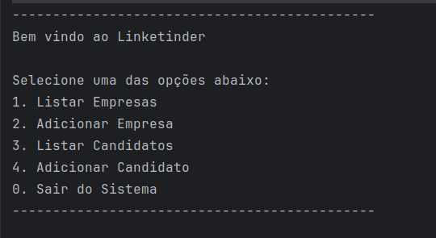
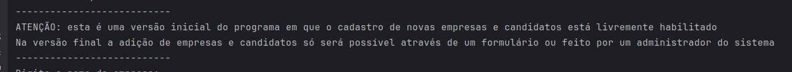

# Linketinder

## Conteúdos:

- [Introdução](#introdução)
- [Executando o Sistema](#executando-o-sistema)
- [Utilizando o Sistema](#utilizando-o-sistema)
    - [Listando Candidatos e Empresas](#listando-candidatos-e-empresas)
    - [Adicionando Candidtos e Empresas](#adicionando-candidatos-e-empresas)
## Introdução
Este projeto é a primeira versão do Linketinder, um projeto audacioso que visa facilitar a contratação de talentos por empresas.
A aplicação consiste em uma mistura de Linkedin com Tinder, onde teremos candidatos em empresas em busca de um match perfeito.

Na versão final da aplicação, os candidatos e empresas poderão visualizar uma lista de potenciais matches de acordo com as suas competências / necessidades.

Esta aplicação visa reduzir a possibilidade de viés por parte dos contrantes e contratados e trazer uma visão estritamente técnica da possível compatibilidade de competências.

Neste momento ainda estamos em fase inicial da construção do aplicativo, portanto ainda dependemos da interação com o terminal para a visualização e inserção de novos cadastros.


## Executando o Sistema

Esta aplicação foi desenvolvida com Groovy, uma linguagem derivada do Java.

Para executar este sistema você deve ter o Java instalado na sua máquina, ou abri-lo utilizando uma IDE com o JVM integrado.

Para maiores informações visite o [site oficial Java](https://www.java.com/en/) e o [site oficial do Groovy](https://groovy-lang.org/index.html).

Com um terminal aberto no local que você deseja salvar este projeto, clone este repositório utilizando o comando

````
git clone https://github.com/ajhopf/linketinder.git
````

Visando facilitar o teste do programa, ao iniciar a aplicação você já terá 5 empresas e 5 candidatos cadastrados.

Se você deseja iniciar o sistema sem nenhum cadastro comente ou elimine a linha 12 do arquivo Main.

```
// com.linketinder.Main.groovy

static void main(String[] args) {
    Map services = criarBeans()
    // IniciarDB.iniciar(services.candidatoService, services.empresaService)

    MenuInicial.iniciar(services.empresaService, services.candidatoService)
}
```

Para iniciar o sistema, execute o método main.

## Utilizando o Sistema

A navegação do sitema é feita através dos números das opções que são mostradas em cada menu.



### Listando Candidatos e Empresas

Ao escolher a opção 1 ou 3 será impressa no terminal uma lista com todos os cadastros do respectivo tipo.


### Adicionando Candidatos e Empresas

Ao escolher a opção 2 ou 4 você entrará no modo de cadastro para aquele respectivo item.

Você irá deparar com a seguinte mensagem:



Ainda estamos em fase inicial da implementação do aplicativo, portanto o cadastro ainda poderá ser realizado sem validações e diretamente pelo terminal.

No futuro para efetuar um novo cadastro a empresa ou candidato deverão preencher um formulário ou solicitar que seja feito por um administrador do sistema.

O formulário para cadastro é simples, sendo necessário apenas digitar a informação solicitada e apertar enter para prosseguir para a próxima pergunta.