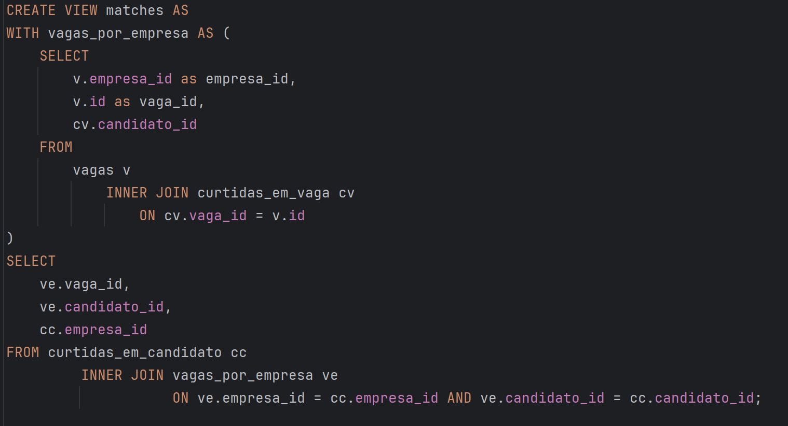
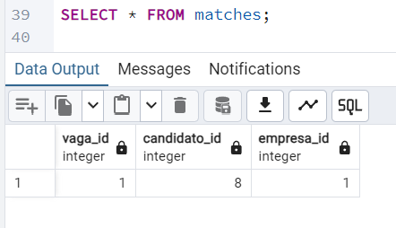
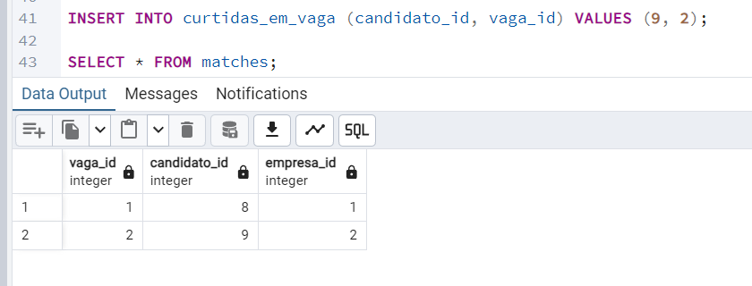

# Linketinder

### Desenvolvido por André Jaques Hopf

## Conteúdos:

- [Introdução](#introdução)
- [Executando o Sistema](#executando-o-sistema)
- [Utilizando o Sistema](#utilizando-o-sistema)
    - [Listando Candidatos e Empresas](#listando-candidatos-e-empresas)
    - [Adicionando Candidtos e Empresas](#adicionando-candidatos-e-empresas)
- [Database](#database)
  - [Match!!](#match)
## Introdução

Link para o front-end:

Repositório: https://github.com/ajhopf/linketinder-front
Site: https://linketinder-front.vercel.app/

Este projeto é a primeira versão do Linketinder, um projeto audacioso que visa facilitar a contratação de talentos por empresas.
A aplicação consiste em uma mistura de Linkedin com Tinder, onde teremos candidatos em empresas em busca de um match perfeito.

Na versão final da aplicação, os candidatos e empresas poderão visualizar uma lista de potenciais matches de acordo com as suas competências / necessidades.

Esta aplicação visa reduzir a possibilidade de viés por parte dos contrantes e contratados e trazer uma visão estritamente técnica da possível compatibilidade de competências.

Neste momento ainda estamos em fase inicial da construção do aplicativo, portanto ainda dependemos da interação com o terminal para a visualização e inserção de novos cadastros.


## Executando o Sistema

Esta aplicação foi desenvolvida com Groovy, uma linguagem derivada do Java.

Para executar este sistema você deve ter o Java instalado na sua máquina, ou abri-lo utilizando uma IDE com o JVM integrado.

Para maiores informações visite o [site oficial Java](https://www.java.com/en/) e o [site oficial do Groovy](https://groovy-lang.org/index.html).

Com um terminal aberto no local que você deseja salvar este projeto, clone este repositório utilizando o comando

````
git clone https://github.com/ajhopf/linketinder.git
````

Visando facilitar o teste do programa, ao iniciar a aplicação você já terá 5 empresas e 5 candidatos cadastrados.

Se você deseja iniciar o sistema sem nenhum cadastro comente ou elimine a linha 12 do arquivo Main.

```
// com.linketinder.Main.groovy

static void main(String[] args) {
    Map services = criarBeans()
    // IniciarDB.iniciar(services.candidatoService, services.empresaService)

    MenuInicial.iniciar(services.empresaService, services.candidatoService)
}
```

Para iniciar o sistema, execute o método main.

## Utilizando o Sistema

A navegação do sitema é feita através dos números das opções que são mostradas em cada menu.


### Listando Candidatos e Empresas

Ao escolher a opção 1 ou 3 será impressa no terminal uma lista com todos os cadastros do respectivo tipo.


### Adicionando Candidatos e Empresas

Ao escolher a opção 2 ou 4 você entrará no modo de cadastro para aquele respectivo item.

Você irá deparar com a seguinte mensagem:


Ainda estamos em fase inicial da implementação do aplicativo, portanto o cadastro ainda poderá ser realizado sem validações e diretamente pelo terminal.

No futuro para efetuar um novo cadastro a empresa ou candidato deverão preencher um formulário ou solicitar que seja feito por um administrador do sistema.

O formulário para cadastro é simples, sendo necessário apenas digitar a informação solicitada e apertar enter para prosseguir para a próxima pergunta.

## PostgreSQL Database

O Linketinder está em evolução!

Os dados são persistidos utilizando o sistema de gerenciamento de banco de dados relacional PostgreSQL. 

Abaixo é possível visualizar a relação entre as tabelas e também as colunas existentes em cada tabela.

Este diagrama foi realizado utilizando http://dbdiagram.io


Link para a modelagem: https://dbdiagram.io/d/66fea3fffb079c7ebd3c107c

Na pasta sql presente na raíz deste projeto existem os scripts para:
  * Criação das tabelas, inserção de 10 competências e cinco endereços - tabelas.sql
  * Inserção de 5 empresas com um endereço, uma competência e uma vaga associada - insere_empresas.sql
  * Inserção de 5 candidatos com um endereço, uma competência e uma formação associada - insere_candidatos.sql

### Curtidas e Match

Finalmente temos o match entre nossos heróis.

No arquivo sql/matches.sql são criadas duas novas tabelas:

* curtidas_em_vaga -> que armazena o id dos candidatos que curtiram cada vaga
* curtidas_em_candidato -> que armazena o id das empresas que curtiram cada candidato

Além disso são inseridos algumas curtidas:


Note que a vaga com id 1(que é da empresa com id 1) foi curtida pelo candidato de id 8 e o candidato 8 curtiu a empresa 1!

Temos o primeiro match de nosso sistema!

Para visualizá-lo, também no arquivo sql/matches.sql criamos uma VIEW chamada matches.



Esta view cria uma tabela chamada 'vagas_por_empresa' que possibilita a visualização de qual foi a empresa que publicou cada vaga que recebeu uma curtida, presente na tabela curtidas_em_vaga.

Então, unimos esta tabela a com a tabela curtidas_em_candidato e buscamos apenas os registros de curtidas que foram mútuas, ou seja, o candidato x curtiu uma vaga de uma empresa y e essa mesma empresa y curtiu  o candidato x.

Basta agora utilizar a view:



Vamos testar um novo match! 

O candidato id 9 foi curtido pela empresa id 2, agora o candidato id 9 irá curtir a vaga de id 2 (que é da empresa de id 2)

