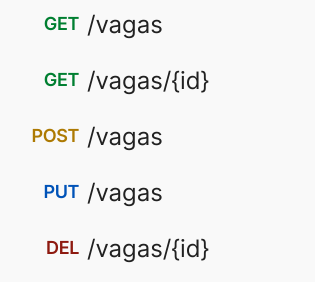

# Linketinder

### Desenvolvido por André Jaques Hopf

## Conteúdos:

- [Introdução](#introdução)
- [Executando o Sistema](#executando-o-sistema)
- [Utilizando o Sistema via Terminal](#utilizando-o-sistema)
    - [Listando Candidatos e Empresas](#listando-candidatos-e-empresas)
    - [Adicionando Candidtos e Empresas](#adicionando-candidatos-e-empresas)
- [Utilizando o Sistema via API](#utilizando-o-sistema-via-api)
  - [Listando Candidatos e Empresas](#listando-candidatos-e-empresas)
  - [Adicionando Candidtos e Empresas](#adicionando-candidatos-e-empresas)
- [Database](#database)
  - [Match!!](#match)
## Introdução

Link para o front-end:

Repositório: https://github.com/ajhopf/linketinder-front
Site: https://linketinder-front.vercel.app/

Este projeto é a primeira versão do Linketinder, um projeto audacioso que visa facilitar a contratação de talentos por empresas.
A aplicação consiste em uma mistura de Linkedin com Tinder, onde teremos candidatos em empresas em busca de um match perfeito.

Na versão final da aplicação, os candidatos e empresas poderão visualizar uma lista de potenciais matches de acordo com as suas competências / necessidades.

Esta aplicação visa reduzir a possibilidade de viés por parte dos contrantes e contratados e trazer uma visão estritamente técnica da possível compatibilidade de competências.

Neste momento ainda estamos em fase inicial da construção do aplicativo, portanto ainda dependemos da interação com o terminal para a visualização e inserção de novos cadastros.

Buscando a aplicação de boas práticas dos princípios de clean code o presente projeto busca:
* Utilizar nomes autoexplicativos para variáveis, métodos e classes
* Utilizar funções pequenas e que realizem apenas uma função específica
* A mínima necessidade de utilizar comentários
* Tratar possíveis erros
* Utilizar testes unitários

## Executando o Sistema

Esta aplicação foi desenvolvida com Groovy e utiliza o Gradle como build tool.

Para executar este sistema você deve ter o Java instalado na sua máquina, ou abri-lo utilizando uma IDE com o JVM integrado.

Você poderá executar o programa utilizando o comando

```
gradle run -q --console=plain
```

Ou, se você preferir, você pode executar a classe 'Main'.

Para maiores informações visite o [site oficial Java](https://www.java.com/en/) e o [site oficial do Groovy](https://groovy-lang.org/index.html).

Com um terminal aberto no local que você deseja salvar este projeto, clone este repositório utilizando o comando

````
git clone https://github.com/ajhopf/linketinder.git
````

Para criar as tabelas e popular o seu banco de dados execute os scripts presentes na pasta sql na seguinte ordem:
1. tabelas.sql (irá criar as tabelas e adicionar competencias e endereços)
2. insere_empresas.sql (irá adicionar 5 empresas com 1 vaga associada a cada uma)
3. insere_candidatos.sql (irá adicionar 5 candidatos com competencias associadas)
4. matches.sql (adiciona as tabelas de curtida e a view de match)

A configuração da conexão com o banco de dados PostgreSQL é realizada pela classe SqlFactory.

A configuração padrão é feita conforme imagem abaixo:


Você provavelmente tem configurações diferentes para o seu banco de dados. Modifique o seu usuário, senha e url de conexão conforme necessário

Para iniciar o sistema, execute o método main ou utilize o comando

```bash
./gradlew run    #linux

gradlew run      #windows
```

## Utilizando o Sistema

A navegação do sitema é feita através dos números das opções que são mostradas em cada menu.


Ainda estamos em fase inicial da implementação do aplicativo, portanto o cadastro ainda poderá ser realizado diretamente pelo terminal sem autenticação.

Este projeto é o backend da aplicação, quando finalizado o projeto, o Linketinder terá uma interface gráfica por onde os cadastros e visualização dos dados será feita.

Uma das premissas no linketinder é o anonimato, ou seja, um candidato não pode saber a empresa que publicou as vagas, e uma empresa não sabe quem é o candidato até o momento em que houver o match.

Essa lógica será melhor explorada nas próximas atualizações do sistema.

Atualmente, através da linha de comando, podemos fazer o CRUD de Competencias, Empresas, Vagas e Candidatos.

mulário para cadastro é simples, sendo necessário apenas digitar a informação solicitada e apertar enter para prosseguir para a próxima pergunta.

Para realizar as operações selecione o número da operação desejada e siga as instruções apresentadas na tela.

## Utilizando o Sistema via API

O linketinder está preparado para receber requisições HTTP. Para possibilitar que o sistema 
escute e responda chamadas HTTP devemos primeiro ter um Tomcat Servlet inicializado.

Siga os passos abaixo para configurar o seu ambiente:

### Baixe o Tomcat

Acesse o link abaixo para baixar a versão 8 do Tomcat (versão compatível com Java 8)

https://ftp.unicamp.br/pub/apache/tomcat/tomcat-8/v8.5.73/bin/

Faça o download do arquivo apache-tomcat-8.5.73.tar.gz  de acordo com o seu sistema operacional.

```
apache-tomcat-8.5.73.tar.gz     #linux
apache-tomcat-8.5.73.zip        #Windows 
```

Após o download, extraia os arquivos em um local definitivo para o tomcat.

### Adicionando as Variáveis de ambiente

Para possibilitar a execução do servidor, adicione às suas variáveis de ambiente o caminho para
o diretório onde você armazenou os arquivos com o nome de CATALINA_HOME

Exemplo para um diretório que está no caminho /home/<usuario>/apache-tomcat

Adicione as seguintes linhas no fim do arquivo .bashrc (se você estiver no linux)

```
export CATALINA_HOME="/home/<usuario>/apache-tomcat/apache-tomcat-8.5.73"
```

Certifique-se também que você possui a variável de ambiente JAVA_HOME com o caminho para a sua
instalação do Java 8 definida. Ela será utilizada pelo Tomcat quando inicializar-mos o servidor.

### Configuração dos WebServlets

Você notará que no diretório src/main do presente projeto existem dois packages, o package
'groovy' que contém o código fonte do sistema e o package webapp.

Dentro do package webapp temos um arquivo de configuração chamado web.xml.
Neste arquivo definimos a classe AppInitializer como um servlet de configuração. Ele é necessário para possibilitar
a injeção de dependências dos controllers.

Na classe AppInitializer adicionamos ao ServletContext os services e controllers que são dependências
para a inicialização dos WebServlets que receberão as chamadas HTTP

AppInitilizer:


As classes que receberão as requisições HTTP (os controllers na arquitetura MVC) devem ser anotadas com 
@WebServlet("/caminhodorecurso") e devem extender a classe HTTPServlet.

Note que no exemplo abaixo o caminho possui um wildcard (o * no fim do caminho).
Isso permite que todas as requisições que comecem com /candidatos sejam processadas por este componente.
Além disso, é necessário que a classe possua um construtor sem parâmetros.

Para fazer a injeção das dependências fazemos o override do método init, herdado do HTTPServlet, e dentro deste método
acessamos o contexto que definimos na classe AppInitilizer.


### Iniciando o Tomcat

Para fazer com que o servidor escute as chamadas que definimos devemos então:

1. Fazer o build da aplicação

Utilize o comando:

```
./gradlew clean build
```

Como o arquivo build.gradle possui o plugin 'war' o processo de build irá gerar um arquivo .war no seguinte diretório:

/build/libs/<projeto>.war


Copie este arquivo para o diretório webapps que existe dentro do diretório raíz da sua instalação do tomcat


Por fim, inicialize o servidor em um terminal com o comando

```angular2html
$CATALINA_HOME/bin/startup.sh
```

Você notará que dentro da pasta webapps agora foi criada uma nova pasta com o nome do seu projeto.

Para finalizar a execução do servidor utilize o comando:

```angular2html
$CATALINA_HOME/bin/shutdown.sh
```

O seu projeto está pronto para receber requisições HTTP!

## API

O Linketinder possui os endpoint para os recursos candidatos, empresas, vagas e competencias

* Listar todos:
  * GET /recurso
  
* Listar recurso pelo id:
  * GET /recurso/{id}
* Adicionar recurso:
  * POST /recurso
  * Todos os campos devem ser enviados com valores. Observe na sessão de exemplos abaixo quais dados deverão ser enviados para cada recurso.
* Editar recurso
  * PUT /recurso
  * Os campos são o mesmo da requisição POST com a adição do campo "id"
* Deletar recurso
  * DELETE /recurso/{id}


Exemplos:

POST /candidatos

* Exemplo de corpo de requisição válido:
  ```json
  {
  "nome": "Vitor",
  "email": "email@email.com",
  "descricao": "Desenvolvedor Back-End Sênior.",
  "senha": 1234556,
  "endereco": {
      "pais": "Brasil",
      "estado": "Santa Catarina",
      "cep": "88063-074",
      "cidade": "Florianópolis"
  },
  "sobrenome": "Lima",
  "cpf": "022.567.432-01",
  "dataNascimento": [
          1992,
          3,
          12
      ],
  "telefone": "(48) 99904-3827",
  "competencias": [
      {
          "competencia": "Java",
          "anosExperiencia": 6.0,
          "afinidade": "MEDIA"
      },
      {
          "competencia": "MongoDB",
          "anosExperiencia": 6.0,
          "afinidade": "MEDIA"
      }
  ]
  }
  
PUT /empresas

```json
{
    "id": 2,
    "nome": "Data Masters Ltd. Atualizada2",
    "email": "info@datamasters.com.br",
    "descricao": "Experts in data analytics and machine learning.",
    "senha": 1234566,
    "endereco": {
        "pais": "Brasil",
        "estado": "Santa Catarina",
        "cep": "88063-074",
        "cidade": "Florianópolis"
    },
    "cnpj": "98.765.432/1098-76"
}
```

POST /vagas
```json
{
    "nome": "uma vaga via api",
    "descricao": "uma vaga de fato muito maneira",
    "empresa": {
        "id": 1
    },
    "endereco": {
        "pais": "Brasil",
        "estado": "Santa Catarina",
        "cep": "88063-074",
        "cidade": "Florianópolis"
    },
    "competencias": [
        {
            "competencia": "Java",
            "anosExperiencia": 4.0,
            "afinidade": "MUITO_ALTA"
        }
    ]
}
```

PUT /competencias
```json
{
    "id": 11,
    "competencia": "Ionic"
}
```

### Resumo dos endpoints

#### Candidatos


#### Empresas


#### Vagas



#### Competencias


## PostgreSQL Database


O Linketinder está em evolução!

Os dados são persistidos utilizando o sistema de gerenciamento de banco de dados relacional PostgreSQL. 

Abaixo é possível visualizar a relação entre as tabelas e também as colunas existentes em cada tabela.

Este diagrama foi realizado utilizando http://dbdiagram.io


Link para a modelagem: https://dbdiagram.io/d/66fea3fffb079c7ebd3c107c

Na pasta sql presente na raíz deste projeto existem os scripts para:
  * Criação das tabelas, inserção de 10 competências e cinco endereços - tabelas.sql
  * Inserção de 5 empresas com um endereço e uma vaga associada - insere_empresas.sql
  * Inserção de 5 candidatos com um endereço, uma competência e uma formação associada - insere_candidatos.sql

### Curtidas e Match

Finalmente temos o match entre nossos heróis.

No arquivo sql/matches.sql são criadas duas novas tabelas:

* curtidas_em_vaga -> que armazena o id dos candidatos que curtiram cada vaga
* curtidas_em_candidato -> que armazena o id das empresas que curtiram cada candidato

Além disso são inseridos algumas curtidas:


Note que a vaga com id 1(que é da empresa com id 1) foi curtida pelo candidato de id 8 e o candidato 8 curtiu a empresa 1!

Temos o primeiro match de nosso sistema!

Para visualizá-lo, também no arquivo sql/matches.sql criamos uma VIEW chamada matches.


Esta view cria uma tabela chamada 'vagas_por_empresa' que possibilita a visualização de qual foi a empresa que publicou cada vaga que recebeu uma curtida, presente na tabela curtidas_em_vaga.

Então, unimos esta tabela a com a tabela curtidas_em_candidato e buscamos apenas os registros de curtidas que foram mútuas, ou seja, o candidato x curtiu uma vaga de uma empresa y e essa mesma empresa y curtiu  o candidato x.

Basta agora utilizar a view:


Vamos testar um novo match! 

O candidato id 9 foi curtido pela empresa id 2, agora o candidato id 9 irá curtir a vaga de id 2 (que é da empresa de id 2)

